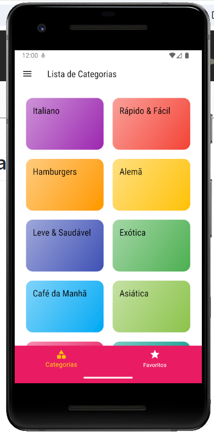
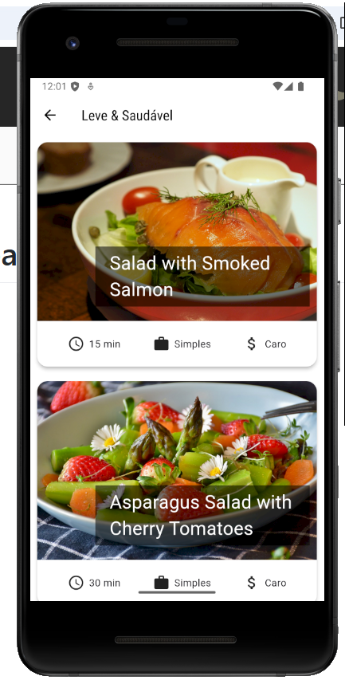
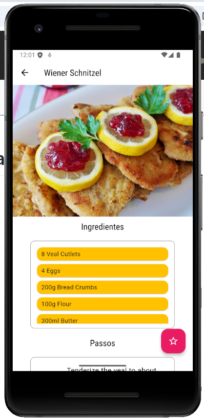
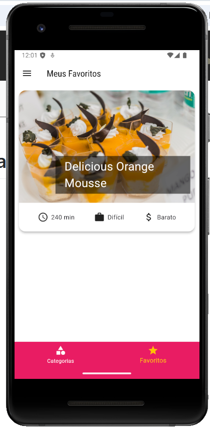
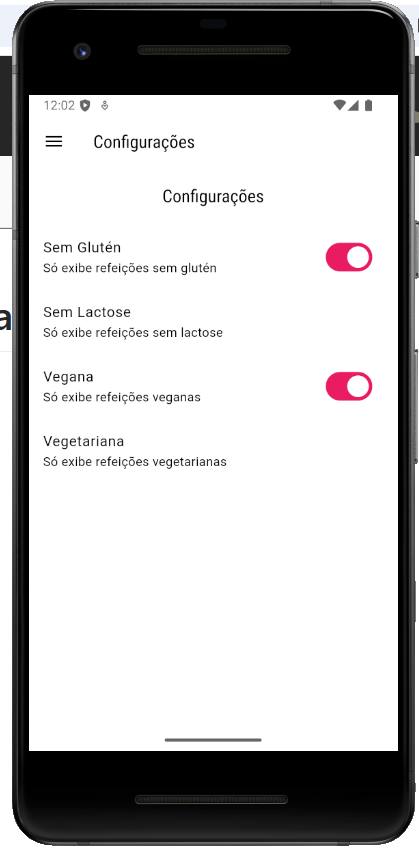

# Meals-App
Aplicativo de gerenciamento e aprendizado de receitas, desenvolvido em Flutter. Permite filtrar as receitas baseado em suas características, bem como favoritar suas receitas preferidas.

## Funcionalidades

- Categoria: Organiza as receitas por categoria, baseado no tipo de refeição que esta se encaixa.
- Receitas detalhadas: Apresenta detalhadamente cada receita, contendo uma imagem, lista de ingredientes, bem como lista de passos para o preparo.
- Função favorito: Permite favoritas as receitas de seu gosto, e as apresenta em uma tela dedicada da aplicação.
- Filtrar por característica: Possui configurações para definição de restrições na visualização das receitas (glúten, lactose, vegana e vegetariana), permitindo ao usuário filtrar apenas as receitas de seu interesse.


## Instalação

Siga as etapas abaixo para configurar e executar o projeto localmente:

### Pré-requisitos
Certifique-se de que você tenha o seguinte instalado:
- [Flutter SDK](https://docs.flutter.dev/get-started/install) (versão compatível com o projeto)
- [Android Studio](https://developer.android.com/studio) ou outro editor de sua preferência (opcional, mas recomendado)
- Emulador ou dispositivo físico conectado

### Passo 1: Clone o repositório
No terminal, execute:
```bash
git clone https://github.com/oJaciel/Meals-App.git
cd Meals-App
```

### Passo 2: Instale as dependências
Execute o comando:
```bash
flutter pub get
```

### Passo 3: Execute o projeto
Inicie o aplicativo com o comando:
```bash
flutter run
```

Certifique-se de que um dispositivo emulador ou físico esteja conectado para que o app seja executado.

## Capturas de Tela

Abaixo estão algumas capturas de tela da aplicação:

### Tela de Categorias


### Tela de Refeições


### Tela de Detalhes da Receita


### Tela de Favoritos


### Tela de Configurações

